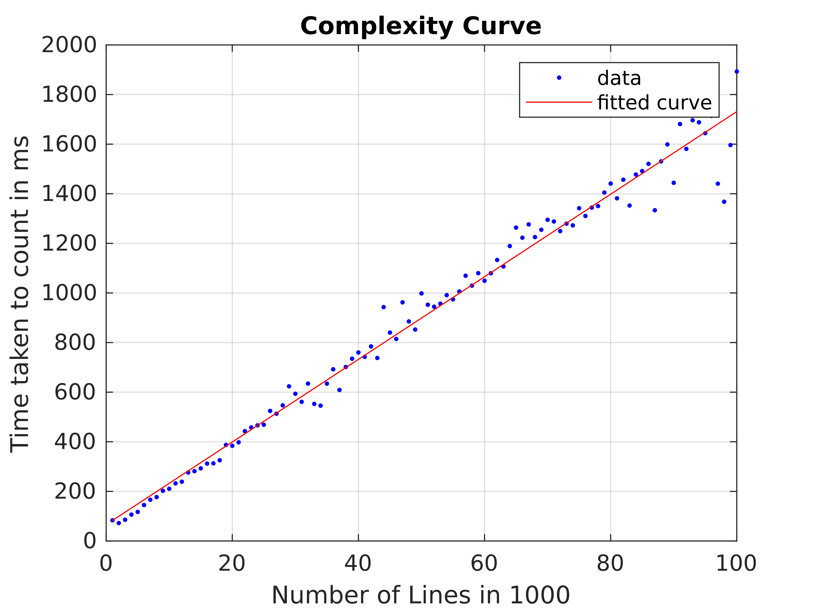

# Line-Count-Complexity-OS
Counting number of lines in a file using Shell Script and determining its time complexity.

This mini-project was developed for the partial fulfilment of the 2nd year, 4th semester of Bachelor of Technology in *Operating System : CSD-222* by following students:-
* [Avinal Kumar](https://github.com/avinal)
* [Harsimranjeet Singh Saini](https://github.com/harry-stark)
* [Pooja Nehra](https://github.com/pooja5101)

Actual Project Statement
> Using a Shell Script define a function count_lines that caounts the number of lines in the file provided asargument. Inside the functionthe value of the argument is retrieved by assessing the varible $1.

>Discuss the complexity of the code and propose your amendments.

## Get Started with the project
1. Prerequisite 
    * Any linux distribution because its a bash based project
    * C++ compiler - gcc or g++ with make utility
    * MatLab to plot the curve
2. Clone this repository and run make command
    ```
    git clone https://github.com/avinal/Line-Count-Complexity-OS
    cd Line-Count-Complexity-OS
    make
    ./complexity_test
    ```
3. This will generate three files *timedur.txt*, *testfile.txt* and *comparefile.txt*. We can now use MatLab to plot the time complexity curve. You can run the above program multiple times with differnt output filename to get better average result.
4. Open MatLab and import all *timedur.txt* and complexity_curve.m files. Currently the matlab function uses two runs of the program you can modify it to average as many runs you want. 
5. Run `complexity_curve` in MatLab command prompt. The curve will be plotted with the line fitting. 


## Analysis
In our experiment we used a text file upto 1 Million lines and tracking the time taken by the script per 1000 line increment. Each line is a same random string of 1000 characters. Here is our result.



As we can see the curve fitting is linear. However at many point result is far from being linear but for the average part we can assume it be linear. 

We can improve the accuracy by running the program multiple time and plot the average result.

We can conclude that the function runs in O(n) time. 

